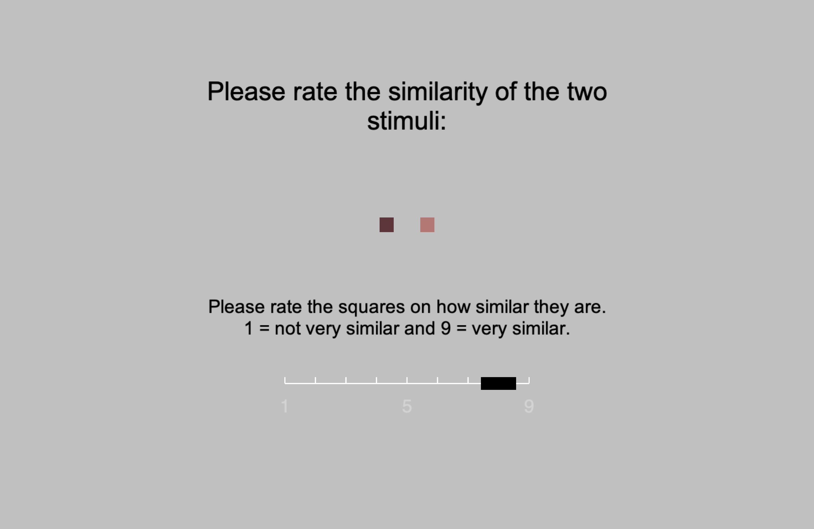

```{r setup, include = FALSE}
## Load packages
source("packages.R")

## Load custom model-fit functions
source("fitfuncs.R")

## Load custom Bayes Factor functions
source("BFfunc.R")
```

Even the simplest of laboratory-based stimuli tend to vary across more than one stimulus attribute. Monochromatic squares are presented at different sizes and brightnesses [@smith1984overall]; pure sine waves at different pitches and intensities [@grau1988distinction]. For many decades, there has been consensus that one of the ways in which multi-attribute stimuli differ from each other is in the level of separability of their dimensions [@garner1976interaction]. For highly separable stimulus dimensions, such as size and brightness, adults find it easy to attend to one of the stimulus dimensions while ignoring the other. In contrast, for integral stimulus dimensions such as pitch and loudness, selective attention is difficult [@garner1976interaction]. Nonetheless, the stimulus dimensions of integral stimuli have psychological reality, as shown by the fact that it is even harder to selectively attend along an arbitrary dimension in stimulus space. For example, for coloured squares of a fixed hue but varying in saturation and brightness, it is easier to classify on the basis of saturation, or brightness, than it is to classify on the basis of arbitrary dimensions that are a 45-degree rotation of the saturation-brightness axes [@foard1984holistic]. Thus, integral dimension pairs, such as saturation and brightness, are both difficult to selectively attend, and are considered as primary or 'privileged' stimulus dimensions.

The study of integral stimuli seems to have been key to the development of a class of theories of processing order in stimulus classification [@lockhead1972processing et seq.]; this class of account being subsequently described as Differentiation Theory [@wills2015combination]. Under Differentiation Theory, integral stimuli are initially perceived as undifferentiated wholes, or "blobs". It proposes that if the task at hand cannot be completed with this holistic stimulus representation then, with time and effort, people can analyze the stimulus into its constituent dimensions.

The domain of Differentiation Theory was widened by subsequent investigators, who argued that even stimuli that were separable for adults under conditions of intentional unspeeded classification (e.g., grey squares varying in size and brightness) were classified holistically by children [@smith1977developmental], by adults under time pressure [@smith1984overall; @ward1983response] or cognitive load [@smith1989occurrence], and by adults who classified under incidental rather than intentional conditions [@nelson1984effect]. Thus, Differentiation Theory was considered to apply quite broadly; people start with an undifferentiated stimulus whole, which they break down into its constituent components if they have the time and mental resources to do so. Under this account, separable and integral stimuli differ in the time or effort required to analyze the stimulus into its component dimensions; with integral and separable stimuli seen as the two poles of a continuum of analyzability. 

Unfortunately, the application of Differentiation Theory to separable stimuli turned out to be an over-extension made on the basis of flawed analyses. In correcting these flaws, @wills2015combination demonstrated that increased time pressure (in terms of stimulus presentation time and limited response time), cognitive load, and incidental training conditions, _increased_ the likelihood that people would classify separable stimuli on the basis of a single stimulus dimension (rather than decrease it as predicted by Differentiation Theory).  This pattern of results is predicted by a class of accounts starting with @neisser1967cognitive, which were subsequently described as Combination Theory [@wills2015combination]. 

Combination Theory is the inverse of Differentiation Theory. It argues that cognition begins with the stimulus attributes (e.g., saturation, brightness), and that these attributes are combined if time and mental resources allow. It provides a sufficient account of the effects of time pressure, cognitive load and incidental training on the classification of separable stimuli [@wills2015combination]. However, it makes a striking and untested prediction concerning integral stimuli. It predicts that sufficient increases in time pressure will increase the prevalence of single-dimension classification of integral stimuli. Thus, despite the difficulty people have in selectively attending to one dimension of an integral stimulus under unspeeded conditions, under sufficiently speeded conditions their classification will nonetheless be more likely to be on the basis of a single stimulus dimension, because they have not yet combined the dimensions. In other words, the properties of integral stimuli under unspeeded conditions come not from the difficulty of differentiating the holistic 'blob' into its constituent dimensions (as Differentiation Theory would predict) but from the rapidity with which the stimulus dimensions are combined. In order to explain performance under unspeeded conditions, Combination Theory must further assume that, once combined, selective attention of dimensions is effortful. This is an existing assumption of Combination Theory, already employed to explain other phenomena [@wills2015combination]. In summary, Combination Theory predicts that reducing the stimulus presentation time will increase the prevalence of single-dimension classification of integral stimuli, while Differentiation Theory predicts the opposite, or the absence of an effect. 

## The current experiments

A key experimental procedure employed in support of Differentiation Theory is the restricted classification (or "triad") task [@garner1976interaction; @smith1984overall; @ward1983response]. Participants are presented with three stimuli, for example the stimuli labelled 6 to 8 in Figure \@ref(fig:redstim). Stimuli 7 and 8 are identical in brightness but quite dissimilar in saturation ('chroma'). Stimuli 6 and 8 are similar on both dimensions, but identical on neither. The task is to pick the two stimuli that 'go together' (or to pick the odd one out). No feedback is given. 

A defining characteristic of integral stimuli is that people have a strong preference to group stimuli 6 and 8 together in this task, i.e., the stimuli that are similar, but not the same, on both dimensions. This is known as an _overall similarity_ (OS) response. For separable stimuli, under full attention and unspeeded conditions, there is a strong preference for adults to group stimuli 7 and 8 together, i.e., the stimuli that are identical on one stimulus dimension but not the other. This is sometimes called a 'dimensional' response, but we prefer the less ambiguous term _identity_ (ID) response [@wills2015combination]. For separable stimuli, stimulus 7 and 8 are grouped together because the identity on one dimension overwhelms the fact that stimuli 6 and 8 are more similar overall. 

```{r redstim, fig.cap="The eight stimuli employed in the current experiments, along with their Munsell Chroma and Brightness values. The text and numbers in this Figure are for reference; only the coloured squares themselves were presented to participants.", out.width = '50%', fig.align='center', echo=FALSE}
knitr::include_graphics('stimfig.png')
```

An important thing to appreciate about the triad task is that while there is always one dimension on which two stimuli are identical, which dimension that is varies unpredictably from trial to trial. For example, while the first trial might involve stimulus triad 6-7-8 in Figure \@ref(fig:redstim), the next might involve triad 1-3-7. In this case, the identity is on the saturation dimension, and an Identity response involves classifying stimuli 1 and 7 together. Thus, in order to classify on the basis of Identity, the participant must be sensitive to both stimulus dimensions, and weigh more heavily the dimension on which there is an identity.

In addition to overall similarity and identity responding, another possible response pattern in the triad task is that the participant's classifications are made on the basis of a single dimension. In other words, a _unidimensional_ (UD) strategy. For example, a participant might classify on the basis of stimulus brightness. In this case, they would classify stimuli 7 and 8 together in the triad 6-7-8, and stimuli 1 and 3 together in triad 1-3-7. Thus, the classification of any single triad supports at least two hypotheses about the participant's behavior. For example, classifying 1 and 3 together from triad 1-2-3 supports both an Overall Similarity hypothesis, and a single-dimension (brightness) hypothesis. It is thus crucial that the participant's responses are considered as a set across multiple trials, some trials involving brightness-identical triads and others saturation-identical triads. It was the lack of a full appreciation of this point that led to the over-extension of Differentiation Theory to separable stimuli, and the adoption of response-set analysis that resolved this issue [@raijmakers2004rules; @thompson1994dimensional; @wills2015combination].

In the current experiments, we apply response-set analysis of the triad task to the effects of stimulus presentation time on classification of integral stimuli varying in brightness and saturation. Combination Theory predicts an increase in the prevalence of single-dimension classification with a decrease in stimulus presentation time. Differentiation Theory predicts the opposite. A strong preference for overall similarity classification in integral stimuli under low time pressure is already well established, and the application of time pressure makes classification data more 'noisy' [ @wills2015combination]. Here, 'noisy' means being either more erratic in the application of a strategy, or more inconsistent in the selection of a strategy in the first place. Wills et al. measured this using the proxy of the number of responses that fit the winning strategy. For both these reasons, we tested about twice as many participants in our short-stimulus-presentation-time conditions than in our long-stimulus-presentation-time conditions.


# Experiment 1 {#ply044}

## Method

```{r pwr-044, echo=FALSE}
## Wills et al. (2015, Exp. 2), chi-square for increase in UD is 8.64. 80 participants tested, two excluded for response bias, leaving N=78)
pwr.wills2015e2  <- sqrt(8.64 / 78)
pwr044  <- pwr.chisq.test(N = 48, df = 1, sig.level = .05, power=.8)
```

### Participants

Forty-six psychology students from XXX University participated for partial course credit; the sample size was determined by the number of course credits available at the time of testing. Our experiment had sufficient (80%) power to detect medium-to-large effects (_w_ = `r round(pwr044$w,2)`) in a chi-squared test. An effect size of approximately similar magnitude (_w_ = `r round(pwr.wills2015e2, 2)`) had previously been observed when applying more subtle time pressure to squares varying in size and brightness [@wills2015combination]. Hence, the sample size provided an initial test of our hypothesis within the resources available. Power calculations were performed using the R package `pwr` [@R-pwr]. The University of XXX Psychology Ethics Committee approved all reported experiments.

### Stimuli and apparatus

Eight coloured squares, 8mm on a side, were used (see Figure \@ref(fig:redstim)). The stimuli were of a red hue (Munsell 5R), and varied in chroma (4-12) and brightness (2-6); this is similar to the colour space employed in @nosofsky1987attention. Note that, in the Munsell system, two units of chroma are psychologically equivalent to one unit of brightness [@nickerson1936specification; @nosofsky1987attention; @shepard1958stimulus]. The positioning of the stimuli within stimulus space followed our previous experiments [@milton2008processes; @wills2015combination].  Eight stimulus triads are possible within this stimulus set (1-3-7, 1-5-7, 2-4-8, 2-6-8, 1-2-3, 1-2-4, 5-7-8, 6-7-8). There are six different ways in which three stimuli can be placed in three spatial locations (e.g., for the 1-3-7 triad, these would be 1-3-7, 1-7-3, 3-1-7, 3-7-1, 7-1-3, 7-3-1). The three stimuli in each triad were presented simultaneously in a horizontal line, with each square separated from the next by an edge-to-edge distance of 8 mm. Thus, each of the eight triads had six different instantiations, resulting in 48 physically different triads per experiment. Stimuli were presented on a 22-inch Philips LED monitor, against a mid-grey background, using E-prime 2; responses were collected using a standard PC keyboard. Participants sat approximately 50cm from the screen; the whole stimulus triad thus subtended approximately five degrees of visual angle horizontally, and one degree vertically.
  
### Procedure

Participants were arbitrarily assigned to one of two conditions, short presentation time or long presentation time. The stimulus presentation times used were 100 ms and 2000 ms. At the beginning of each trial, the screen displayed the message "Ready?" and the participant pressed a key to continue. After this, a small fixation cross was presented in the centre of the screen, for 500 ms. The stimulus triad was then presented for the appropriate duration, and then immediately replaced by the message "Odd one out?" The participant pressed the number key 1, 2 or 3 to indicate the left, middle, or right stimulus, respectively. The next trial began immediately upon detection of a response. 

Each of the 48 physically different stimulus triads were presented twice, with order of presentation randomized for each participant. The randomization was constrained such that each block of eight trials contained exactly one of the eight logical triads (1-3-7, 1-5-7, etc.). At the end of each block, the participants received an on-screen reminder of the instructions, and pressed a key when they were ready to continue. 

### Strategy analysis
To determine the strategy used by each participant, the participants' responses were compared to each of the three categorisation strategies mentioned above: unidimensional (UD), overall similarity (OS), and identity (ID). Additionally, we checked to see whether any participants were best described by a Response Bias strategy (Bias). To determine the strategy used by each participant, we first determined for each of the 48 possible triad stimuli what the response should be given each of these strategies. For the UD strategy, the response would be the pair that was be closest on a particular dimension. 
For the OS strategy, the response would be the pair that was the most similar overall. 
For the ID strategy, the response would be the pair that shared an identical feature. 
For the Bias strategy, the response would be where the participant pressed the same key throughout the experiment.
We then counted, for each strategy and participant, how many of the participant's responses matched the predicted response of that strategy. Then, the participant's strategy was the strategy that best matched the participant's responses

\vspace{2em}

```{r ply044-init, echo=FALSE, message=FALSE, results='hide'}
eda.ply44  <- read_csv("data/ply44data.csv")

## List of subject numbers by condition
ply044.N  <- eda.ply44 %>% filter(!duplicated(subj)) %>% select(cond, subj)

```

```{r ply044-model-init, echo=FALSE, message=FALSE, results='hide'}

## Derive model predictions for all 48 physical trial types

## Extract mapping of stim code to physically presented stimulus file names,
## from raw data
preds  <- eda.ply44 %>% select(triad, left1, mid2, right3)
preds  <- distinct(preds) %>% arrange(triad)

## Extract mapping of stimulus file names to co-ordinates
coords  <- read_csv("munsell-coords_red.csv") %>% select(stim, chroma, bright)
coords  <- coords %>% mutate(chroma = chroma / 2)
colnames(coords)  <- c("stim", "sat", "bright")

## Add co-ordinates to preds
preds  <- preds %>% rowwise() %>%
    mutate(L1.sat = coords$sat[left1]) %>%
    mutate(L1.bri = coords$bright[left1]) %>%
    mutate(M2.sat = coords$sat[mid2]) %>%
    mutate(M2.bri = coords$bright[mid2]) %>%
    mutate(R3.sat = coords$sat[right3]) %>%
    mutate(R3.bri = coords$bright[right3]) 

## Add model predictions
preds$os  <- NA
preds$bright  <- NA
preds$chroma  <- NA
preds$ident      <- NA

for(rw in 1:nrow(preds)) {
    preds$os[rw]  <- ooo(preds[rw, 5:10], 1, 1)
    preds$bright[rw]  <- ooo(preds[rw, 5:10], 0, 1)
    preds$chroma[rw]  <- ooo(preds[rw, 5:10], 1, 0)
    preds$ident[rw]  <- ooo.id(preds[rw, 5:10])    
}

## Subsequent code previously used hand-coded predictions
## loaded into 'cde'. For backwards compatibility:
cde  <- preds
```

```{r ply044-model-fit, echo=FALSE, message=FALSE, results='hide', cache=TRUE}
## Fit each response model to each participant, using all response blocks to do
## so.

bigdta  <- eda.ply44 ## The array 'bigdata' is assumed by the function 'ppfits'
ppts.ply44  <- as.numeric(ply044.N$subj)
bigmod.ply44 <- array(0, dim=c(length(ppts.ply44),14))
bigmod.ply44 <- t(mapply(ppfits, ppts.ply44, 0)) ## This line does the model fits
colnames(bigmod.ply44) <- c("subj","cond","blk","bright", "chroma","ud",
                      "os", "ident", "resp1", "resp2", 
                      "resp3", "model", "consist","margin")

## Convert output to more informative labels
bigmf.ply44 <- as.data.frame(bigmod.ply44)
bigmf.ply44$model[bigmf.ply44$model > 3] <- 'Bias'
bigmf.ply44$model[bigmf.ply44$model == 1] <- 'UD'
bigmf.ply44$model[bigmf.ply44$model == 2] <- 'OS'
bigmf.ply44$model[bigmf.ply44$model == 3] <- 'ID'
bigmf.ply44$cond[bigmf.ply44$cond==1] <- '100 ms'
bigmf.ply44$cond[bigmf.ply44$cond==2] <- '2000 ms'
```


```{r ply44-model, echo=FALSE, message=FALSE}
mf.calc.ply44  <- table(bigmf.ply44$cond, bigmf.ply44$model)  # Cross tab

## Make table for purposes of display
mf.sum.ply44  <- as.data.frame(mf.calc.ply44)
colnames(mf.sum.ply44)  <- c("Time", "Model", "Freq") # Name columns
## Adding absence of ID model
mf.sum.ply44  <- mf.sum.ply44 %>% add_row(Time = "100 ms", Model = "ID", Freq = 0)
mf.sum.ply44  <- mf.sum.ply44 %>% add_row(Time = "2000 ms", Model = "ID", Freq = 0)
mf.sum.ply44  <- mf.sum.ply44 %>% pivot_wider(names_from = Model, values_from = Freq)

mf.sum.ply44  <- mf.sum.ply44 %>% select(Time, UD, OS, ID, Bias)

# Hacky way of getting proportions in table as requested by reviewer
mf.sum.ply44$UD <- c("1 (0.0345)", "0 (0)")
mf.sum.ply44$OS <- c("27 (0.931)", "17 (1.00)")
mf.sum.ply44$Bias <- c("1 (0.0345)", "0 (0)")

knitr::kable(
           mf.sum.ply44, row.names=FALSE, digits=2,
           caption = 'Number of participants (and proportion of participants) best fit by a unidimensional (UD), overall similarity (OS), identity (ID), or response bias (Bias) model, as a function of stimulus presentation time, in Experiment 1.',
           booktabs = TRUE
       )

## Bayesian chi-square
mf.bf.ply44  <- contingencyTableBF(mf.calc.ply44[,2:3],
                             fixedMargin="rows",
                             sampleType="indepMulti")
mf.bf.ply44.val  <- round(extractBF(mf.bf.ply44)$bf, 2)
```


## Results and discussion

Table \@ref(tab:ply44-model) shows, as expected, that there was a strong preference for overall similarity classification at 2000 ms. However, shortening the presentation time to 100 ms appeared to have little effect. One participant was best fit by a response-bias model (i.e., always pressing the same key), one by the assumption they were responding on the basis of a single dimension. All the other participants remained best fit by an overall similarity account. Bayesian analysis, conducted with the `BayesFactor` R package [@R-BayesFactor], indicated that the ratio of unidimensional to overall similarity classifiers was unaffected by our time pressure manipulation, $BF_{10}$ = `r mf.bf.ply44.val`. This result is not diagnostic between Combination Theory and Differentiation Theory. Differentiation Theory can attribute the lack of increase in overall-similarity classification to a ceiling effect, and Combination Theory can attribute it to the manipulation being insufficiently potent to produce a detectable effect.

In a further, exploratory, analysis we fitted the same response models to each eight-trial block of responses separately, deriving the number of blocks which, for each participant, were best fit by each model. Although this analysis is a novel one for the triad task, we have employed it in previous experiments using the match-to-standards procedure [@wills2013overall]. We speculated that this analysis might be more sensitive to low levels of unidimensional classification, assuming that, due to both internal and external noise, participants sometimes successfully classified on the basis of both dimensions but other times did not have time to combine both dimensions and hence responded on the basis of a single dimension. This analysis was conducted on 45 participants, as one participant had been found to best fit a response-bias model. Response-bias models can only be fit at a whole-participant level, not an individual-block level, because it is only at the participant level that the physical position of the stimuli on the screen is counterbalanced. 

\vspace{2em}


```{r ply044-model-block, echo=FALSE, message=FALSE, results='hide', cache=TRUE}
## Fit each response model to each block of each participant, using all response blocks to do
## so.
bigdta <- bigdta[bigdta$subj != 20,] # Remove response bias participant
ppts.blk.ply44 <- as.numeric(levels(as.factor(bigdta$subj)))
bigmodblk.ply44 <- t(mapply(ppfits,rep(ppts.blk.ply44,each=12),1:12)) # Fit to each block
colnames(bigmodblk.ply44) <-colnames(bigmod.ply44)

# Convert to more informative labels
bigmfblk.ply44 <- as.data.frame(bigmodblk.ply44)
bigmfblk.ply44$model[bigmfblk.ply44$model == 1] <- 'UD'
bigmfblk.ply44$model[bigmfblk.ply44$model == 2] <- 'OS'
bigmfblk.ply44$model[bigmfblk.ply44$model == 3] <- 'ID'
bigmfblk.ply44$cond[bigmfblk.ply44$cond==1] <- '100 ms'
bigmfblk.ply44$cond[bigmfblk.ply44$cond==2] <- '2000 ms'

## Remove response bias fit columns - these analyses were not conducted.
bigmfblk.ply44  <- bigmfblk.ply44 %>% select(-resp1, -resp2, -resp3)
```

```{r ply44-block-report, echo=FALSE, message=FALSE}
## Figures for reporting
N.ties.ply44  <- bigmfblk.ply44 %>% filter(margin == 0) %>% summarise(N= n())
N.ppts.ply44  <- length(unique(bigmfblk.ply44$subj))
N.blks.ply44  <- length(unique(bigmfblk.ply44$blk))

## Remove tied blocks
bigmfblk.ply44  <- bigmfblk.ply44 %>% filter(margin > 0)

## Aggregate for analysis

## Count model wins
blk.sum.ply44  <- as.data.frame(table(bigmfblk.ply44$subj, bigmfblk.ply44$model))
colnames(blk.sum.ply44)  <- c("subj", "Model", "Freq")
blk.sum.ply44  <- blk.sum.ply44 %>% pivot_wider(names_from=Model, values_from=Freq)

## Bind condition data back into frame
conds.ply44  <- bigmfblk.ply44 %>% select(subj, cond) %>% distinct
conds.ply44$subj  <- as.factor(conds.ply44$subj)
blk.sum.ply44  <- right_join(conds.ply44, blk.sum.ply44)

## Calculate proportions (note: some missing blocks due to ties)
blk.sum.ply44  <- blk.sum.ply44 %>% mutate(total = ID+OS+UD)
blk.sum.ply44  <- blk.sum.ply44 %>% mutate(ID.p = ID/total, OS.p = OS/total, UD.p = UD/total)

blk.report.ply44  <- blk.sum.ply44 %>% group_by(cond) %>%
    summarise(UD = mean(UD.p),
              OS = mean(OS.p),
              ID = mean(ID.p)) 

## Produce table for report
colnames(blk.report.ply44)  <- c("Time", "UD", "OS", "ID")

knitr::kable(
           blk.report.ply44, row.names=FALSE, digits=3,
           caption = 'Mean proportion of unidimensional (UD), overall similarity (OS), and identity (ID) blocks, as a function of stimulus presentation time, in Experiment 1.',
           booktabs = TRUE
       )

ud.bf.ply44  <- ttestBF(formula = UD.p ~ cond, data = data.frame(blk.sum.ply44))
ud.bf.val.ply44  <- round(extractBF(ud.bf.ply44)$bf, 2)
```

\vspace{2em}


On `r round(N.ties.ply44*100/(N.ppts.ply44*N.blks.ply44),0)`% of blocks, models tied for first place; these blocks were removed from further analysis. Table \@ref(tab:ply44-block-report) shows the results of this by-block analysis. The crucial result is that participants in the 100 ms condition produce more classification blocks best fit by a unidimensional response model than participants in the 2000 ms condition, $BF_{10}$ = `r ud.bf.val.ply44`. Hence reducing the stimulus presentation time increased unidimensional responding, even for these integral stimuli. This result is predicted by Combination Theory, and disconfirms Differentiation Theory. 

One obvious criticism of this conclusion is that it is based on a post-hoc analysis which, despite having precedents in the literature, was only engaged after our a priori analysis failed to reveal conclusive results. For this reason, we conducted a direct replication.


# Experiment 2 {#ply062}

```{r ply062-preproc, echo=FALSE, message=FALSE, warning=FALSE, results='hide'}
eda.ply62  <- read_csv("data/ply62data.csv")

## List of subject numbers by condition
ply062.N  <- eda.ply62 %>% filter(!duplicated(subj)) %>% select(cond, subj)
ply062.n1  <-  as.numeric(ply062.N %>% filter(cond == 1) %>% summarise(n()))
ply062.n2  <-  as.numeric(ply062.N %>% filter(cond == 2) %>% summarise(n()))

```

```{r ply062-pwr, , echo=FALSE, message=FALSE, warning=FALSE, results='hide'}
## Power calculation on basis of ply044 effect size
ud.cohen.ply44  <- cohen.d(blk.sum.ply44$UD.p ~ blk.sum.ply44$cond)

pwr.ply062  <- pwr.t2n.test(d=ud.cohen.ply44$estimate, alternative="greater",
                            n1 = ply062.n1, n2 = ply062.n2)

```

## Method

Fifty psychology students from XXX University participated for partial course credit; this sample size has sufficient (`r round(pwr.ply062$power*100, 0)`%) power to detect the medium-to-large effect observed in the by-blocks analysis of the previous experiment (d = `r round(ud.cohen.ply44$estimate, 2)`). The stimuli, apparatus, and procedure, were identical to the previous experiment.

\vspace{2em}


```{r ply062-model-fit, echo=FALSE, message=FALSE, results='hide', cache=TRUE}
## Fit each response model to each participant, using all response blocks to do
## so.
## We still need to do this in order to remove anyone who is best fit by a
## response bias model.

bigdta  <- eda.ply62 ## Name 'bigdta' assumed by ppfits function
ppts.ply62  <- as.numeric(ply062.N$subj)
bigmod.ply62 <- array(0, dim=c(length(ppts.ply62),14))
bigmod.ply62 <- t(mapply(ppfits, ppts.ply62, 0)) ## This line does the model fits
colnames(bigmod.ply62) <- c("subj","cond","blk","bright", "chroma","ud",
                      "os", "ident", "resp1", "resp2", 
                      "resp3", "model", "consist","margin")

## Convert output to more informative labels
bigmf.ply62 <- as.data.frame(bigmod.ply62)
bigmf.ply62$model[bigmf.ply62$model > 3] <- 'Bias'
bigmf.ply62$model[bigmf.ply62$model == 1] <- 'UD'
bigmf.ply62$model[bigmf.ply62$model == 2] <- 'OS'
bigmf.ply62$model[bigmf.ply62$model == 3] <- 'ID'
bigmf.ply62$cond[bigmf.ply62$cond==1] <- '100 ms'
bigmf.ply62$cond[bigmf.ply62$cond==2] <- '2000 ms'
```

```{r ply062-model-block, echo=FALSE, message=FALSE, results='hide', cache=TRUE}
exclude  <- bigmf.ply62 %>% filter(model == "Bias") %>% select(subj)

## Fit each response model to each block of each participant, using all response blocks to do
## so.
bigdta  <- eda.ply62
bigdta <- bigdta %>% filter(!(subj %in% exclude)) # Exclude bias ppts
ppts.blk.ply62 <- levels(as.factor(bigdta$subj))
bigmodblk.ply62 <- t(mapply(ppfits,rep(ppts.blk.ply62, each=12),1:12)) # Fit to each block
colnames(bigmodblk.ply62) <-colnames(bigmod.ply62)

# Convert to more informative labels
bigmfblk.ply62 <- as.data.frame(bigmodblk.ply62)
bigmfblk.ply62$model[bigmfblk.ply62$model == 1] <- 'UD'
bigmfblk.ply62$model[bigmfblk.ply62$model == 2] <- 'OS'
bigmfblk.ply62$model[bigmfblk.ply62$model == 3] <- 'ID'
bigmfblk.ply62$cond[bigmfblk.ply62$cond==1] <- '100 ms'
bigmfblk.ply62$cond[bigmfblk.ply62$cond==2] <- '2000 ms'

## Remove response bias fit columns - these analyses were not conducted.
bigmfblk.ply62  <- bigmfblk.ply62 %>% select(-resp1, -resp2, -resp3)
```

```{r ply62-block-report, echo=FALSE, message=FALSE}
## Figures for reporting
N.ties.ply62  <- bigmfblk.ply62 %>% filter(margin == 0) %>% summarise(N= n())
N.ppts.ply62  <- length(unique(bigmfblk.ply62$subj))
N.blks.ply62  <- length(unique(bigmfblk.ply62$blk))

## Remove tied blocks
bigmfblk.ply62  <- bigmfblk.ply62 %>% filter(margin > 0)

## Aggregate for analysis

## Count model wins
blk.sum.ply62  <- as.data.frame(table(bigmfblk.ply62$subj, bigmfblk.ply62$model))
colnames(blk.sum.ply62)  <- c("subj", "Model", "Freq")
blk.sum.ply62  <- blk.sum.ply62 %>% pivot_wider(names_from=Model, values_from=Freq)

## Bind condition data back into frame
conds.ply62  <- bigmfblk.ply62 %>% select(subj, cond) %>% distinct
conds.ply62$subj  <- as.factor(conds.ply62$subj)
blk.sum.ply62  <- right_join(conds.ply62, blk.sum.ply62)

## Calculate proportions (note: some missing blocks due to ties)
blk.sum.ply62  <- blk.sum.ply62 %>% mutate(total = ID+OS+UD)
blk.sum.ply62  <- blk.sum.ply62 %>% mutate(ID.p = ID/total, OS.p = OS/total, UD.p = UD/total)

blk.report.ply62  <- blk.sum.ply62 %>% group_by(cond) %>%
    summarise(UD = mean(UD.p),
              OS = mean(OS.p),
              ID = mean(ID.p)) 

## Produce table for report
colnames(blk.report.ply62)  <-  c("Time", "UD", "OS", "ID")

knitr::kable(
           blk.report.ply62, row.names=FALSE, digits=3,
           caption = 'Mean proportion of unidimensional (UD), overall similarity (OS), and identity (ID) blocks, as a function of stimulus presentation time, in Experiment 2.',
           booktabs = TRUE
       )

## Significant when done with BayesFactor package, but this does not take
## into account clear prior. 
ud.bf.ply62  <- ttestBF(formula = UD.p ~ cond, data = data.frame(blk.sum.ply62))
ud.bf.val.ply62  <- round(extractBF(ud.bf.ply62)$bf, 2)

## Use the Dienes method to incorporate the prior
ttest.ply62  <- t.test(UD.p ~ cond, data = blk.sum.ply62)
mean_diff  <- as.numeric(ttest.ply62$estimate[1] - ttest.ply62$estimate[2])
sd_err  <- mean_diff / ttest.ply62$statistic
mean_theory  <- as.numeric(blk.report.ply44[1, 'UD'] - blk.report.ply44[2, 'UD'])
dienes.bf.ply62  <- Bf(sd=sd_err, obtained=mean_diff, uniform=0, 
         meanoftheory=mean_theory, sdtheory=mean_theory/2, tail=1)

```

\vspace{2em}

## Results and discussion

`r toTitleCase(n2w(nrow(exclude)))` participant was excluded due to being best fit by a response-bias model. On `r round(N.ties.ply62*100/(N.ppts.ply62*N.blks.ply62),0)`% of blocks, models tied for first place; these blocks were removed from further analysis. Table \@ref(tab:ply62-block-report) shows the key results, which are similar to the previous experiment. Crucially, shorter presentation times (compared to longer presentation times) once again increased the prevalence of unidimensional classification of these integral stimuli, $BF_{10}$ = `r round(dienes.bf.ply62$BayesFactor,0)`. This Bayesian calculation makes use of a prior based on the size of the effect in the previous experiment. Specifically, following @dienes2011bayesian, we used a normally-distributed prior of effect sizes, centered on the observed difference in the previous experiment, and with a standard deviation of half that observed difference. There is also Bayesian evidence for the effect of stimulus presentation time on unidimensional responding  if one entirely ignores the prior provided by the previous experiment and uses a non-directional test against a non-informative prior, as performed in the previous experiment, $BF_{10}$ = `r ud.bf.val.ply62`. 

# Experiment 3 {-}

Our final experiment had two purposes. First, we wished to confirm that the stimuli as presented in the first two experiments met a standard Garner definition of integrality, i.e. the pairwise similarity ratings were better fit by a Euclidean than a city-block multidimensional scaling (MDS) solution [@garner1976interaction]. Second, we wished to assess the closeness of the resulting MDS solution to the solution provided by the Munsell colour codes attributed to these stimuli. If differences were to be found, we would then use the MDS solution in a re-analysis of the triad data that represents the stimuli in terms of a psychological, rather than physical, stimulus space.

## Method {-}

### Participants, apparatus and stimuli {-}

Twenty-four participants were tested in this experiment; the sample size was determined by the number of course credits available at the time of testing and is similar to past experiments [e.g., @bergman2016auditory; @gaissert2012categorizing; @livingston1998categorical; @shin1992similarity] and is in line with the sample size shown by @rodgers1991matrix to lead to good metric recovery. 
PsychoPy software [@pierce2007psychopy], version 1.83, was used to present the stimuli and to collect responses via a standard PC keyboard and mouse. The stimuli were the same as in the two previous experiments.

### Procedure {-}

```{r screenshot, fig.cap="A screenshot of a single example trial from Experiment 3.", out.width = '50%', fig.align='center', echo=FALSE}

```

After some initial instructions explaining the task, the experiment began. On each trial, two square stimuli were shown in the centre of the screen, arranged horizontally, and placed 2cm apart as measured from their centres (see Figure \@ref(fig:screenshot)). Participants were asked to rate the similarity of each pair of stimuli using a 1-9 scale. The scale was visually presented on the screen, below the square stimuli, along with text specifying that "1 = not very similar" and "9 = very similar". The number 5 was also indicated on the scale, but not further labelled. A moveable rectangular slider was present on this scale. Initially placed above the number 5, participants moved this slider to one of the nine available ratings using the mouse and indicated their response with a mouse click. The screen cleared immediately after the participant's response, and the next trial began one second later.

The experiment had two blocks of 56 trials. A block comprised two presentations of each possible pair of the eight stimuli, with left-right position of the stimulus pair counterbalanced across those two presentations. Trial ordering was randomized separately for each block and participant. 

## Results and discussion {-}

```{r dist-mat, echo=FALSE, message=FALSE, warning=FALSE, results='hide'}
## Load data
alldat  <- read_csv("data/ply84data.csv")

## Recode for stimulus pair, regardless of screen location, and as distance
alldat  <- alldat %>% rowwise() %>%
    mutate(low = min(lcol:rcol), high = max(lcol:rcol), dist = 10-sim)

## Average across all participants
avdat <- alldat %>% group_by(low, high) %>% summarize(dist = mean(dist))

## Create distance matrix
stims  <- 8
dm  <- array(0, dim = c(stims, stims))
for(rw in 1:nrow(avdat)) {
    one  <- avdat[rw,]
    dm[avdat$high[rw], avdat$low[rw]]  <- avdat$dist[rw]
}
show.sm  <- 10-dm # Archive matrix for report output
dm  <- as.dist(dm)
```

```{r sim-ply084, tidy=FALSE, echo=FALSE}
## This is a bit of a hack because kable can't deal with the 'dist'
## data type of distance matrices.
options(knitr.kable.NA = '')
show.sm[show.sm == 10]  <- NA
show.sm  <- show.sm[2:8,1:7]
colnames(show.sm)  <- 1:7
rownames(show.sm)  <- 2:8
knitr::kable(
           show.sm, row.names=TRUE, digits=2,
           caption = 'Pairwise similarity ratings.',
  booktabs = TRUE
)
```

```{r echo=FALSE, message=FALSE, results='hide'}
mds.model.city  <- isoMDS(dm, k = 2, p = 1)
mds.model  <- isoMDS(dm, k = 2, p = 2)
```

The average pairwise similarity ratings for the eight stimuli are shown in Table \@ref(tab:sim-ply084). Two-dimensional, non-metric multidimensional scaling [@kruskal1964nonmetric] was applied to these data, using the `isoMDS` function of the R package `MASS` [@R-MASS]. The stress of the Euclidean solution (`r round(mds.model$stress, 2)`) was lower than the city-block solution (`r round(mds.model.city$stress, 2)`), implying that these stimuli are better considered as integral than separable by Garner's operational definition. 

```{r echo=FALSE, message=FALSE, results='hide'}
munsell  <- read_csv("munsell-coords_red.csv")
munsell  <- munsell %>% mutate(chroma = chroma / 2) %>% select(chroma, bright)
cmp  <- procrustes(munsell, mds.model, truemean=TRUE)
```

Figure \@ref(fig:ply084-mds) shows the Euclidean MDS solution, scaled and Procrustean rotated for best fit to the co-ordinates of the stimuli in the Munsell colour system; these rigid transformations do not affect the distance relationships in a Euclidean MDS solution. The `procrustes` function of the R package `vegan` [@R-vegan] was used for this part of the analysis. Following standard practice, we assumed that, in the Munsell system, two units of chroma are psychologically equivalent to one unit of brightness [@nickerson1936specification; @nosofsky1987attention; @shepard1958stimulus]. 

```{r ply084-mds, fig.cap="Multidimensional scaling solution", out.width='80%', fig.align='center', echo=FALSE}
rot  <- data.frame(fitted(cmp))
colnames(rot)  <- c("Chroma", "Brightness") 
rot  <- rot %>% add_column(.before=TRUE, Stimulus=1:8)

mds.plot  <-
    ggplot(rot, aes(x = Chroma, y = Brightness)) +
    geom_text(aes(label = Stimulus)) +
    xlab('Chroma / 2') +
    scale_x_continuous(limits = c(2,6), breaks=2:6) +
    scale_y_continuous(limits = c(1,7), breaks=1:7) +
    theme_bw()
mds.plot
```

Inspection of Figure \@ref(fig:ply084-mds) indicates that, for six of the eight stimuli, the MDS solution shows similarity relations comparable to those in the Munsell co-ordinates. The exceptions are stimuli 2 and 4, which would appear to have been perceived as somewhat brighter and more saturated than their Munsell co-ordinates would indicate. This may have been a function of our use of commodity hardware for screen display. 

Given these moderate discrepancies between the Munsell co-ordinates and the multidimensional scaling solution, we re-analyzed the data from the previous two experiments, combining the two datasets and using the MDS co-ordinates as the inputs to our response models, rather than the Munsell co-ordinates. 

```{r ply084-model-init, echo=FALSE, message=FALSE, results='hide'}

## Derive model predictions for all 48 physical trial types

## We already have 'preds' from ply044, just need to modify
preds.84  <- preds %>% select(triad, left1, mid2, right3)

## We also have the coordinates, from the MDS solution. Just rename
coords.84  <- rot
colnames(coords.84)  <- c("stim", "sat", "bright")

## Add co-ordinates to preds
preds.84  <- preds.84 %>% rowwise() %>%
    mutate(L1.sat = coords.84$sat[left1]) %>%
    mutate(L1.bri = coords.84$bright[left1]) %>%
    mutate(M2.sat = coords.84$sat[mid2]) %>%
    mutate(M2.bri = coords.84$bright[mid2]) %>%
    mutate(R3.sat = coords.84$sat[right3]) %>%
    mutate(R3.bri = coords.84$bright[right3]) 

## Add model predictions, using functions defined in ply044
## Ident predictions will be broken due to no exact identities in MDS solution
## Insert zeros here so ID never makes a correct prediction by luck later

preds.84$os  <- NA
preds.84$bright  <- NA
preds.84$chroma  <- NA
preds.84$ident      <- 0

for(rw in 1:nrow(preds)) {
    preds.84$os[rw]  <- ooo(preds.84[rw, 5:10], 1, 1)
    preds.84$bright[rw]  <- ooo(preds.84[rw, 5:10], 0, 1)
    preds.84$chroma[rw]  <- ooo(preds.84[rw, 5:10], 1, 0)
}

## Load into array expected by fitting functions
cde <- preds.84 

```

```{r ply084-model-fit, echo=FALSE, message=FALSE, results='hide', cache=TRUE}
## Fit everyone we've tested against MDS co-ords
eda.ply44 <- eda.ply44 %>% add_column(exp = "ply044")
eda.ply62  <- eda.ply62 %>% add_column(exp = "ply062")
eda.ply84  <- bind_rows(eda.ply44, eda.ply62)
## (Thankfully subject numbers are unique across both experiments)

## Fit each response model to each participant, using all response blocks to do
## so.
bigdta  <- eda.ply84
ppts.ply84  <- c(as.numeric(ply044.N$subj), as.numeric(ply062.N$subj))
bigmod.ply84 <- array(0, dim=c(length(ppts.ply84),14))
bigmod.ply84 <- t(mapply(ppfits, ppts.ply84, 0)) ## This line does the model fits
colnames(bigmod.ply84) <- c("subj","cond","blk","bright", "chroma","ud",
                      "os", "ident", "resp1", "resp2", 
                      "resp3", "model", "consist","margin")

## Convert output to more informative labels
bigmf.ply84 <- as.data.frame(bigmod.ply84)
bigmf.ply84$model[bigmf.ply84$model > 3] <- 'Bias'
bigmf.ply84$model[bigmf.ply84$model == 1] <- 'UD'
bigmf.ply84$model[bigmf.ply84$model == 2] <- 'OS'
bigmf.ply84$model[bigmf.ply84$model == 3] <- 'ID'
bigmf.ply84$cond[bigmf.ply84$cond==1] <- '100 ms'
bigmf.ply84$cond[bigmf.ply84$cond==2] <- '2000 ms'
```

```{r ply084-model-block, echo=FALSE, message=FALSE, results='hide', cache=TRUE}
exclude.84 <- bigmf.ply84 %>% filter(model == "Bias") %>% select(subj)

## Fit each response model to each block of each participant, using all response blocks to do
## so.
bigdta  <- eda.ply84
bigdta <- bigdta %>% filter(!(subj %in% exclude.84)) # Exclude bias ppts
ppts.blk.ply84 <- levels(as.factor(bigdta$subj))
bigmodblk.ply84 <- t(mapply(ppfits,rep(ppts.blk.ply84, each=12),1:12)) # Fit to each block
colnames(bigmodblk.ply84) <-colnames(bigmod.ply84)

# Convert to more informative labels
bigmfblk.ply84 <- as.data.frame(bigmodblk.ply84)
bigmfblk.ply84$model[bigmfblk.ply84$model == 1] <- 'UD'
bigmfblk.ply84$model[bigmfblk.ply84$model == 2] <- 'OS'
bigmfblk.ply84$model[bigmfblk.ply84$model == 3] <- 'ID'
bigmfblk.ply84$cond[bigmfblk.ply84$cond==1] <- '100 ms'
bigmfblk.ply84$cond[bigmfblk.ply84$cond==2] <- '2000 ms'

## Remove response bias fit columns - these analyses were not conducted.
bigmfblk.ply84  <- bigmfblk.ply84 %>% select(-resp1, -resp2, -resp3)
```

```{r ply84-block-report, echo=FALSE, message=FALSE}
## Figures for reporting
N.ties.ply84  <- bigmfblk.ply84 %>% filter(margin == 0) %>% summarise(N= n())
N.ppts.ply84  <- length(unique(bigmfblk.ply84$subj))
N.blks.ply84  <- length(unique(bigmfblk.ply84$blk))

## Remove tied blocks
bigmfblk.ply84  <- bigmfblk.ply84 %>% filter(margin > 0)

## Aggregate for analysis

## Count model wins
blk.sum.ply84  <- as.data.frame(table(bigmfblk.ply84$subj, bigmfblk.ply84$model))
colnames(blk.sum.ply84)  <- c("subj", "Model", "Freq")
blk.sum.ply84  <- blk.sum.ply84 %>% pivot_wider(names_from=Model, values_from=Freq)

## Bind condition data back into frame
conds.ply84  <- bigmfblk.ply84 %>% select(subj, cond) %>% distinct
conds.ply84$subj  <- as.factor(conds.ply84$subj)
blk.sum.ply84  <- right_join(conds.ply84, blk.sum.ply84)

## Calculate proportions (note: some missing blocks due to ties)
## (note 2: ID will never win in this analysis)
blk.sum.ply84  <- blk.sum.ply84 %>% mutate(total = UD+OS)
blk.sum.ply84  <- blk.sum.ply84 %>% mutate(ID.p = 0, OS.p = OS/total, UD.p = UD/total)

blk.report.ply84  <- blk.sum.ply84 %>% group_by(cond) %>%
    summarise(UD = mean(UD.p),
              OS = mean(OS.p),
              ID = mean(ID.p)) 

## Produce table for report
colnames(blk.report.ply84)  <-  c("Time", "UD", "OS", "ID")

knitr::kable(
           blk.report.ply84, row.names=FALSE, digits=3,
           caption = 'Mean proportion of unidimensional (UD), overall similarity (OS), and identity (ID) blocks, as a function of stimulus presentation time.',
           booktabs = TRUE
       )

## Bayesian analysis without prior, as both experiments combined
ud.bf.ply84  <- ttestBF(formula = UD.p ~ cond, data = data.frame(blk.sum.ply84))
ud.bf.val.ply84  <- round(extractBF(ud.bf.ply84)$bf, 0)

```

`r toTitleCase(n2w(nrow(exclude.84)))` participants were excluded due to being best fit by a response-bias model. On `r round(N.ties.ply84*100/(N.ppts.ply84*N.blks.ply84),0)`% of blocks, models tied for first place; these blocks were removed from further analysis. Table \@ref(tab:ply84-block-report) shows the results of
our re-analysis. Using the MDS co-ordinates for these stimuli approximately doubled the magnitude of the effect observed with the Munsell co-ordinates; unidimensional responding rose from 9% at 2000 ms to 32% at 100 ms. Bayesian analysis, employing a non-informative prior, provides very strong support for an effect of stimulus presentation time on the prevalence of unidimensional responding, _BF_ = `r ud.bf.val.ply84`. Hence, overall, the three experiments presented in the current paper provide strong evidence for the effect predicted by Combination Theory, and disconfirm Differentiation Theory.

Further inspection of Figure \@ref(fig:ply084-mds) reveals that no stimulus is identically placed on either dimension (this is true even for stimuli 2 and 4 on the chroma dimension). As a consequence, the Identity response model can never predict participants' responses, leading to reported zero prevalence of Identity responding in Table \@ref(tab:ply84-block-report). It would in principle be possible to generalize the Identity response model such that it could deal with near-identity (such as stimuli 2 and 4 on chroma) effectively, and the work of @smith1989model suggests a way in which this could be done. However, given the very low prevalence of ID classification observed for these stimuli in our earlier analysis, where the use of Munsell co-ordinates would have made such responding detectable if it had occurred, such a generalization of the Identity model would be unlikely to change the conclusions of the current work. 

# General Discussion

As stimulus presentation time decreases, the prevalence of single-dimension classification of multi-attribute stimuli increases [@wills2015combination]. This phenomenon is well established for separable stimuli (e.g. squares varying in size and brightness), but the current experiments are the first demonstration for integral stimuli (specifically, for squares varying in saturation and brightness). Intuitively, this effect of stimulus presentation time on integral stimuli may seem surprising. After all, under unspeeded conditions, it is well established that selectively attending to integral stimulus dimensions requires effort [@garner1976interaction]. Such observations have led some to conclude that cognition begins with an undifferentiated stimulus whole, which is analyzed into its components only with effort [@lockhead1972processing et seq.]; a view subsequently described as Differentiation Theory [@wills2015combination]. However, our results support an approximately opposite account - cognition begins with stimulus attributes, which are combined if time and mental resources allow [@neisser1967cognitive et seq.]; an account subsequently described as Combination Theory [@wills2015combination]. Once attributes are combined, selective attention is somewhat effortful, and that effort is greater for integral than for separable stimuli. Under a Combination Theory account synthesis, rather than analysis, is the more appropriate chemical metaphor. Integral stimuli, rather than being slowly analyzed, are quickly synthesized. 

While we believe that our results add to the growing body of evidence that supports Combination theory over Differentiation theory [e.g., @milton2008processes; @wills2015combination] and that the extension of this evidence to integral stimuli is particularly noteworthy, our results do not, of course, challenge Garner's classic integral-separable distinction itself [e.g., @garner1974processing; @garner1970integrality] which is based on a robust and diverse set of evidence  including  the demonstration of Garner Interference [e.g., @pomerantz1983global; @pomerantz1986visual] and redundancy gains [@garner1970integrality].

Indeed, this distinction may at least partially explain the virtual absence of ID sorting that we observed with integral stimuli in the long presentation time condition in contrast to the relatively high levels of ID sorting with separable stimuli  previously found under a similar time constraint [e.g., @wills2015combination]. For separable stimuli, the ability to selectively attend and switch between dimensions is assumed to become easier as presentation time increases which makes ID responding an easier and more commonly used approach.  However, for integral stimuli, once synthesis has occurred it is much harder to selectively attend to the individual dimensions than for separable stimuli and harder still to switch between the two dimensions which is necessary to consistently make ID responses. This added difficulty of selectively attending to integral than separable dimensions after they have been combined may therefore explain the virtual absence of ID sorting in the current experiments in contrast to the relatively high prevalence of this approach with separable stimuli.

It is also worth noting that whilst our pattern of results appear to be robust, the precise mechanisms that underlie the effect remain uncertain and Combination Theory does make any direct predictions in this regard. This is because categorization involves a number of processes (e.g., perceptual, attentional, decisional/strategic and action) that are unlikely to be independent of each other making partitioning the precise contribution of these various components at the very least extremely difficult. 

Although the current experiments concern the presentation of simple stimuli in the laboratory, the distinction between Differentiation and Combination Theory is of broader relevance. The terms 'analytic' and 'nonanalytic' (or 'holistic') are broadly applied in psychology as theories of modes of thought. Such terms seem to assume the correctness of Differentiation Theory (otherwise terms such as 'synthetic' would be more appropriate). Given that Differentiation Theory seems to be largely the wrong theory for the classification of simple stimuli, an investigation of the extent to which the predictions of Differentiation Theory are correct across psychology more generally seems worthy of further examination. For example, a form of Differentiation Theory seems to underlie the proposal that the training of radiologists could be improved by distracting them with a secondary task [@filoteo2010removing], while Combination Theory predicts that this is likely to be harmful [@newell2013reinstating]. A second example - one of the key ways WEIRD (Western Educated Industrialized Rich and Democratic) populations are described as differing from some other cultures is in the unusual extent to which WEIRD thought is characteristically 'analytic' rather than 'holisitic' [@henrich2010weirdest]. Such a description presupposes a form of Differentiation Theory. 

Returning to the experiments reported in the current paper, the same-lab replication of our results reduces the chances that we are reporting a false positive, but replication by an independent lab would further increase confidence, and we are keen to support such efforts. Our materials and analysis methods are publicly available. One crucial aspect for successful replication of our results is the well-controlled presentation of precisely-defined stimuli; the logic of the experiment requires, for example, that the location of stimuli in physical stimulus space (Figure \@ref(fig:redstim)) corresponds reasonably closely to their position in psychological stimulus space. Investigations of our own stimuli (reported in Experiment 3) support the conclusion that, in our case, the correspondence was sufficiently close that our conclusions remain valid (in fact, use of a psychological stimulus space strengthens the support for our conclusions). Nonetheless, future investigators may wish to take further steps towards tight stimulus control (for example, the use of more specialist hardware for stimulus presentation). 

In the current work, we used color stimuli varying in saturation and brightness as they have perhaps been the most commonly used integral stimuli in past  categorization research [e.g., @foard1984holistic; @little2013logical; @nosofsky1987attention]. However, one could potentially argue that a very short stimulus time  may have altered the perception of the colors themselves which could potentially have influenced our results. It is not clear how such a possibility could directly be tested in our paradigm. However, it would be helpful in future work to extend our results to other integral stimulus sets, perhaps with pure tones differing in pitch and loudness [@grau1988distinction] or sets with more than two dimensions [e.g., @vigo2022raising].

Finally, it would be interesting to see which formal process models of classification can accommodate the current results. EGCM [@lamberts1995categorization] seems a likely candidate, as does any other model that explicitly combines stimulus dimensions over time [@cohen2003extension]. A further promising approach is Vigo et al.'s [-@vigo2022raising] recent dual discrimination invariance model (DDIM) which has been shown to provide an excellent account of the classification of three-dimensional integral stimuli although it may need to be extended to include a time component to provide a full explanation of our current data. In contrast, theories such as COVIS [@ashby1998neuropsychological], in which responding on the basis of a single dimension is a function of the effortful use of the rule-based system, seem conceptually closer to Differentiation Theory, and hence may require some modification in order to accommodate the present results. 

<!--\newpage!-->

# References

```{r include=FALSE}
# automatically create a bib database for R packages
knitr::write_bib(.packages(), 'packages.bib')
```

\begingroup
\setlength{\parindent}{-0.5in}
\setlength{\leftskip}{0.5in}

<div id="refs" custom-style="Bibliography"></div>
\endgroup
