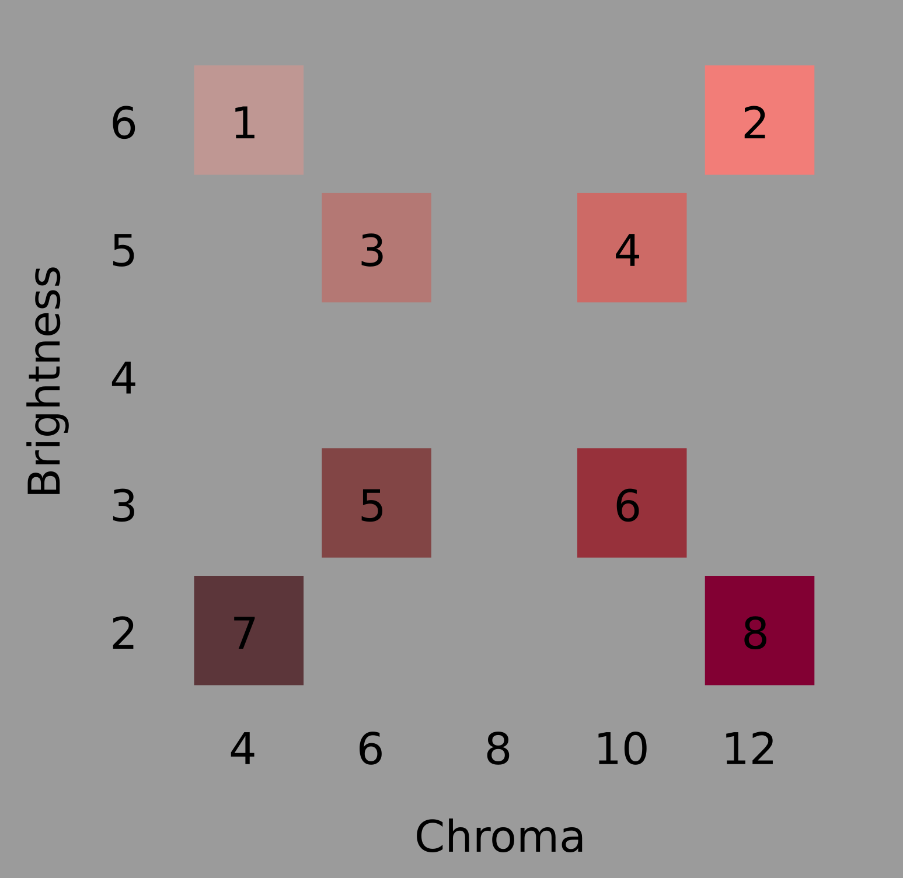

--- 
title: "The rapid synthesis of integral stimuli"
author: " "
date: " "
output:
  bookdown::pdf_document2:
    keep_tex: false
documentclass: article
csl: apa.csl
linestretch: 2
geometry: "left=2.5cm, right=2.5cm, top=2.5cm, bottom=2.5cm"
bibliography: [book.bib, packages.bib]
toc: false
link-citations: yes
---

```{r pkgs, echo=FALSE, warning=FALSE, message=FALSE}
## Load packages
source("packages.R")

## Load custom model-fit functions
source("fitfuncs.R")
## Load custom Bayes Factor functions
source("BFfunc.R")

## Reinstate above to unmask authorsdx
##author:
##  - Andy J. Wills, University of Plymouth, UK
##  - C.E.R. Edmunds, Queen Mary University of London, UK
##  - Fraser Milton, University of Exeter, UK
## date: "`r Sys.Date()`"

```

### Abstract {-}

Integral stimuli (e.g. colours varying in saturation and brightness) are classically considered to be processed holistically (i.e. as undifferentiated stimulus wholes); people analyze such stimuli into their consistent dimensions only with substantial time, effort, training, or instruction [@foard1984holistic]. In contrast, Combination Theory [@wills2015combination] argues that the dimensions of integral stimuli are quickly combined. Through an investigation of the effects of time pressure, we support Combination Theory over the classical holistic-to-analytic account. Specifically, using colored squares varying in saturation and brightness, we demonstrate that the prevalence of single-dimension classification increases as stimulus presentation time is reduced. We conclude that integral stimuli are not slowly analyzed, they are quickly synthesized. 

### Statement of relevance {-}

In everyday life, and across psychology, we distinguish between 'holistic' and 'analytic' styles of thought. For example, we might propose that some cultures, professions, personality types, or genders, are more prone to approaching problems from a holistic or an analytic perspective. The same may be said of informal theories of education and development, where one sometimes hears that 'analytic skills' increase with age. The use of the word 'analytic' employs a metaphor that thought begins with compounds, and that our 'cognitive chemist' labors to analyze that compound into its elements. In the current paper, we provide new evidence for an approximately opposite metaphor: Combination Theory. In Combination Theory, cognition begins with the elements, which are subsequently synthesized into compounds. This theory has potential implications for education, and for our understanding of cultural differences. 

# {-}

Even the simplest of laboratory-based stimuli tend to vary across more than one stimulus attribute. Monochromatic squares are presented at different sizes and brightnesses [@smith1984overall]; pure sine waves at different pitches and intensities [@grau1988distinction]. For many decades, there has been consensus that one of the ways in which multi-attribute stimuli differ from each other is in the level of separability of their dimensions [@garner1976interaction]. For highly separable stimulus dimensions, such as size and brightness, adults find it easy to attend to one of the stimulus dimensions while ignoring the other. In contrast, for integral stimulus dimensions such as pitch and loudness, selective attention is difficult [@garner1976interaction]. Nonetheless, the stimulus dimensions of integral stimuli have psychological reality, as shown by the fact that it is even harder to selectively attend along an arbitrary dimension in stimulus space. For example, for colored squares of a fixed hue but varying in saturation and brightness, it is easier to classify on the basis of saturation, or brightness, than it is to classify on the basis of arbitrary dimensions that are a 45-degree rotation of the saturation-brightness axes [@foard1984holistic]. Thus, integral dimension pairs, such as saturation and brightness, are both difficult to selectively attend, and primary or 'privileged' stimulus dimensions.

The study of integral stimuli seems to have been key to the development of a class of theories of processing order in stimulus classification [@lockhead1972processing et seq.]; this class of account being subsequently described as Differentiation Theory [@wills2015combination]. Under Differentiation Theory, integral stimuli are initially perceived as undifferentiated wholes, or "blobs". If the task at hand cannot be completed with this holistic stimulus representation then, with time and effort, people can analyze the stimulus into its consistuent dimensions.

The domain of Differentiation Theory was widened by subsequent investigators, who argued that even stimuli that were separable for adults under conditions of intentional unspeeded classification (e.g. gray squares varying in size and brightness) were classified holistically by children [@smith1977developmental], by adults under time pressure [@smith1984overall; @ward1983response] or cognitive load [@smith1989occurrence], and by adults who classified under incidental rather than intentional conditions [@nelson1984effect]. Thus, Differentiation Theory was seen to apply quite broadly; people start with an undifferentiated stimulus whole, which they break down into its consituent components if they have the time and mental resources to do so. Under this account, separable and integral stimuli differ in the time or effort required to analyze the stimulus into its component dimensions; with integral and separable stimuli seen as the two poles of a continuum of analyzability. 

The application of Differentiation Theory to separable stimuli turned out to be an over-extension made on the basis of flawed analyses. In correcting these flaws, @wills2015combination demonstrated that increased time pressure, cognitive load, and incidental training conditions, _increased_ the likelihood that people would classify separable stimuli on the basis of a single stimulus dimension (rather than decrease it as Differentiation Theory would predict).  This pattern of results is predicted by a class of accounts starting with @neisser1967cognitive, which were subsequently described as Combination Theory [@wills2015combination]. 

Combination Theory is the inverse of Differentiation Theory. It argues that cognition begins with the stimulus attributes (e.g. saturation, brightness), and that these attributes are combined if time and mental resources allow. It provides a sufficient account of the effects of time pressure, cognitive load and incidental training on the classification of separable stimuli [@wills2015combination]. However, it makes a striking and untested prediction concerning integral stimuli. It predicts that sufficient increases in time pressure will increase the prevalence of single-dimension classification of integral stimuli. Thus, despite the difficulty people have in selectively attending to one dimension of an integral stimulus under unspeeded conditions, under sufficiently speeded conditions their classification will nonetheless be more likely to be on the basis of a single stimulus dimension, because they have not yet combined the dimensions. In other words, the properties of integral stimuli under unspeeded conditions come not from the difficulty of differentiating the holistic 'blob' into its consistuent dimensions (as Differentiation Theory would predict) but from the rapidity with which the stimulus dimensions are combined. In order to explain performance under unspeeded conditions, Combination Theory must further assume that, once combined, selective attention of dimensions is effortful. This is an existing assumption of Combination Theory, already employed to explain other phenomena [@wills2015combination]. In summary, Combination Theory predicts that time pressure will increase the prevalence of single-dimension classification of integral stimuli, while Differentiation Theory predicts the opposite, or the absence of an effect. 


## The current experiments {-}

A key experimental procedure employed in support of Differentiation Theory is the restricted classification (or "triad") task [@garner1976interaction; @smith1984overall; @ward1983response]. Participants are presented with three stimuli, for example the stimuli labelled 6 to 8 in Figure \@ref(fig:redstim). Stimuli 7 and 8 are identical in brightness but quite dissimilar in saturation ('chroma'). Stimuli 6 and 8 are similar on both dimensions, but identical on neither. The task is to pick the two stimuli that 'go together' (or to pick the odd one out). No feedback is given. 

A defining characteristic of integral stimuli is that people have a strong preference to group stimulus 6 and 8 together in this task. This is known as an _overall similarity_ response. For separable stimuli, under full attention and unspeeded conditions, there is a strong preference for adults to group stimulus 7 and 8 together. This is sometimes called a 'dimensional' response, but we prefer the less ambiguous term _identity_ response [@wills2015combination]. For separable stimuli, stimulus 7 and 8 are grouped together because the identity on one dimension overwhelms the fact that stimuli 6 and 8 are more similar overall. 


```{r redstim, fig.cap="The eight stimuli employed in the current experiments, along with their Munsell Chroma and Brightness values. The text and numbers in this Figure are for reference; only the colored squares themselves were presented to participants.", out.width = '50%', fig.align='center', echo=FALSE}

```

An important thing to appreciate about the triad task is that while there is always one dimension on which two stimuli are identical, which dimension that is varies unpredictably from trial to trial. For example, while the first trial might involve stimulus triad 6-7-8 in Figure \@ref(fig:redstim), the next might involved triad 1-3-7. In this case, the identity is on the saturation dimension, and an Identity response involves classifying stimuli 1 and 7 together. Thus, in order to classify on the basis of Identity, the participant must be sensitive to both stimulus dimensions, and weigh more heavily the dimension on which there is an identity.

In addition to overall similarity and identity responding, another possible response pattern in the triad task is that the participant's classifications are made on the basis of a single dimension. For example, a participant might classify on the basis of stimulus brightness. In this case, they would classify stimulus 7 and 8 together in the triad 6-7-8, and stimulus 1 and 3 together in triad 1-3-7. Thus, the classification of any single triad supports at least two hypotheses about the participant's behavior. For example, classifying 1 and 3 together from triad 1-2-3 supports both an Overall Similarity hypothesis, and a single-dimension (brightness) hypothesis. It is thus crucial that the participant's responses are considered as a set across multiple trials, some trials involving brightness-identical triads and others saturation-identical triads. It was the lack of a full appreciation of this point that led to the over-extension of Differentiation Theory to separable stimuli, and the adoption of response-set analysis that resolved this issue [@raijmakers2004rules; @thompson1994dimensional; @wills2015combination].

In the current experiments, we apply response-set analysis of the triad task to the effects of time pressure on classification of integral stimuli varying in brightness and saturation. Combination Theory predicts an increase in the prevalence of single-dimension classification with increasing time pressure. Differentiation Theory predicts the opposite. A strong preference for overall similarity classification in integral stimuli under low time pressure is already well established, and the application of time pressure makes classification data more 'noisy' [ @wills2015combination]. For both these reasons, we tested about twice as many participants in our high-time-pressure conditions than in our low-time-pressure conditions.

# Experiment 1 {-#ply044}

## Method {-}

```{r pwr-044, echo=FALSE}
## Wills et al. (2015, Exp. 2), chi-square for increase in UD is 8.64. 80 participants tested, two excluded for response bias, leaving N=78)
pwr.wills2015e2  <- sqrt(8.64 / 78)
pwr044  <- pwr.chisq.test(N = 48, df = 1, sig.level = .05, power=.8)
```

### Participants {-}

Forty-six psychology students from Plymouth University participated for partial course credit; the sample size was determined by the number of course credits available at the time of testing. Our experiment had sufficient (80%) power to detect medium-to-large effects (_w_ = `r round(pwr044$w,2)`). An effect size of approximately similar magnitude (_w_ = `r round(pwr.wills2015e2, 2)`) had previously been observed when applying more subtle time pressure to squares varying in size and brightness [@wills2015combination]. Hence, the sample size provided an initial test of our hypothesis within the resources available. Power calculations were performed using the R package `pwr` [@R-pwr]. 

### Stimuli and apparatus {-}

Eight colored squares, 8mm on a side, were used (see Figure \@ref(fig:redstim)). The stimuli were of a red hue (Munsell 5R), and varied in chroma (4-12) and brightness (2-6); this is similar to the color space employed in @nosofsky1987attention. Note that, in the Munsell system, two units of chroma are psychologically equivalent to one unit of brightness [@nickerson1936specification; @nosofsky1987attention; @shepard1958stimulus]. The positioning of the stimuli within stimulus space followed our previous experiments [@milton2008processes; @wills2015combination].  Eight stimulus triads are possible within this stimulus set (1-3-7, 1-5-7, 2-4-8, 2-6-8, 1-2-3, 1-2-4, 5-7-8, 6-7-8). There are six different ways in which three stimuli can be placed in three spatial locations and thus each of the eight triads had six different instantiations, resulting in 48 physically different triads per experiment. The three stimuli in each triad were presented simultaneously in a horizontal line, with each square separated from the next by an edge-to-edge distance of 8 mm. Stimuli were presented on a 22-inch Philips LED monitor, against a mid-gray background, using E-prime 2; responses were collected using a standard PC keyboard. Participants sat approximately 50cm from the screen; the whole stimulus triad thus subtended approximately five degrees of visual angle horizontally, and one degree vertically.
  

### Procedure {-}

Participants were arbitrarily assigned to one of two conditions, high time pressure or low time pressure. The two conditions were identical except for stimulus presentation time. The stimulus presentation times used were 100 ms and 2000 ms. At the beginning of each trial, the screen displayed the message "Ready?" and the participant pressed a key to continue. After this, a small fixation cross was presented in the center of the screen, for 500 ms. The stimulus triad was then presented for the appropriate duration, and then immediately replaced by the message "Odd one out?" The participant pressed the number key 1, 2 or 3 to indicate the left, middle, or right stimulus, respectively. The next trial began immediately upon detection of a response. 

Each of the 48 physically different stimulus triads were presented twice, with order of presentation randomized for each participant. The randomization was constrained such that each block of eight trials contained exactly one of the eight logical triads (1-3-7, 1-5-7, etc.). At the end of each block, the participants received an on-screen reminder of the instructions, and pressed a key when they were ready to continue. 

## Results {-}

```{r ply044-init, echo=FALSE, message=FALSE, results='hide'}
eda.ply44  <- read_csv("data/ply44data.csv")

## List of subject numbers by condition
ply044.N  <- eda.ply44 %>% filter(!duplicated(subj)) %>% select(cond, subj)

```

```{r ply044-model-init, echo=FALSE, message=FALSE, results='hide'}

## Derive model predictions for all 48 physical trial types

## Extract mapping of stim code to physically presented stimulus file names,
## from raw data
preds  <- eda.ply44 %>% select(triad, left1, mid2, right3)
preds  <- distinct(preds) %>% arrange(triad)

## Extract mapping of stimulus file names to co-ordinates
coords  <- read_csv("munsell-coords_red.csv") %>% select(stim, chroma, bright)
coords  <- coords %>% mutate(chroma = chroma / 2)
colnames(coords)  <- c("stim", "sat", "bright")

## Add co-ordinates to preds
preds  <- preds %>% rowwise() %>%
    mutate(L1.sat = coords$sat[left1]) %>%
    mutate(L1.bri = coords$bright[left1]) %>%
    mutate(M2.sat = coords$sat[mid2]) %>%
    mutate(M2.bri = coords$bright[mid2]) %>%
    mutate(R3.sat = coords$sat[right3]) %>%
    mutate(R3.bri = coords$bright[right3]) 

## Add model predictions
preds$os  <- NA
preds$bright  <- NA
preds$chroma  <- NA
preds$ident      <- NA

for(rw in 1:nrow(preds)) {
    preds$os[rw]  <- ooo(preds[rw, 5:10], 1, 1)
    preds$bright[rw]  <- ooo(preds[rw, 5:10], 0, 1)
    preds$chroma[rw]  <- ooo(preds[rw, 5:10], 1, 0)
    preds$ident[rw]  <- ooo.id(preds[rw, 5:10])    
}

## Subsequent code previously used hand-coded predictions
## loaded into 'cde'. For backwards compatibility:
cde  <- preds
## And also save out to be picked up by Exp. 2 analysis code
##write_csv(cde, "tmp/stimcode.csv")

```

```{r ply044-model-fit, echo=FALSE, message=FALSE, results='hide', cache=TRUE}
## Fit each response model to each participant, using all response blocks to do
## so.

bigdta  <- eda.ply44 ## The array 'bigdata' is assumed by the function 'ppfits'
ppts.ply44  <- as.numeric(ply044.N$subj)
bigmod.ply44 <- array(0, dim=c(length(ppts.ply44),14))
bigmod.ply44 <- t(mapply(ppfits, ppts.ply44, 0)) ## This line does the model fits
colnames(bigmod.ply44) <- c("subj","cond","blk","bright", "chroma","ud",
                      "os", "ident", "resp1", "resp2", 
                      "resp3", "model", "consist","margin")

## Convert output to more informative labels
bigmf.ply44 <- as.data.frame(bigmod.ply44)
bigmf.ply44$model[bigmf.ply44$model > 3] <- 'Bias'
bigmf.ply44$model[bigmf.ply44$model == 1] <- 'UD'
bigmf.ply44$model[bigmf.ply44$model == 2] <- 'OS'
bigmf.ply44$model[bigmf.ply44$model == 3] <- 'ID'
bigmf.ply44$cond[bigmf.ply44$cond==1] <- '100 ms'
bigmf.ply44$cond[bigmf.ply44$cond==2] <- '2000 ms'
```

```{r ply44-model, echo=FALSE, message=FALSE}
mf.calc.ply44  <- table(bigmf.ply44$cond, bigmf.ply44$model)  # Cross tab

## Make table for purposes of display
mf.sum.ply44  <- as.data.frame(mf.calc.ply44)
colnames(mf.sum.ply44)  <- c("Time", "Model", "Freq") # Name columns
## Adding absence of ID model
mf.sum.ply44  <- mf.sum.ply44 %>% add_row(Time = "100 ms", Model = "ID", Freq = 0)
mf.sum.ply44  <- mf.sum.ply44 %>% add_row(Time = "2000 ms", Model = "ID", Freq = 0)
mf.sum.ply44  <- mf.sum.ply44 %>% pivot_wider(names_from = Model, values_from = Freq)

mf.sum.ply44  <- mf.sum.ply44 %>% select(Time, UD, OS, ID, Bias)

knitr::kable(
           mf.sum.ply44, row.names=FALSE, digits=2,
           caption = 'Number of participants best fit by a unidimensional (UD), overall similarity (OS), identity (ID), or response bias (Bias) model, as a function of stimulus presentation time.',
           booktabs = TRUE
       )

## Bayesian chi-square
mf.bf.ply44  <- contingencyTableBF(mf.calc.ply44[,2:3],
                             fixedMargin="rows",
                             sampleType="indepMulti")
mf.bf.ply44.val  <- round(extractBF(mf.bf.ply44)$bf, 2)
```

Table \@ref(tab:ply44-model) shows, as expected, that there was a strong preference for overall similarity classification at 2000 ms. However, shortening the presentation time to 100 ms appeared to have little effect. One participant was best fit by a response-bias model (i.e. always pressing the same key), one by the assumption they were responding on the basis of a single dimension. All the other participants remained best fit by an overall similarity account. Bayesian analysis, conducted with the `BayesFactor` R package [@R-BayesFactor], indicated that the ratio of unidimensional to overall similarity classifiers was unaffected by our time pressure manipulation, _BF_ = `r mf.bf.ply44.val`. This result is not diagnostic between Combination Theory and Differentiation Theory. Differentiation Theory can attribute the lack of increase in overall-similarity classification to a ceiling effect, and Combination Theory can attribute it to the time pressure manipulation being insufficiently potent to produce a detectable effect.

In a further, exploratory, analysis we fitted the same response models to each eight-trial block of responses separately, deriving the number of blocks which, for each participant, were best fit by each model. Although this analysis is a novel one for the triad task, we have employed it in previous experiments using the match-to-standards procedure [@wills2013overall]. We speculated that this analysis might be more sensitive to low levels of unidmimensional classification, assuming that, due to both internal and external noise, participants sometimes successfully classified on the basis of both dimensions but other times did not have time to combine both dimensions and hence responded on the basis of a single dimension. This analysis was conducted on 45 participants, as one participant had been found to best fit a response-bias model. Response-bias models can only be fit at a whole-participant level, not an individual-block level, because it is only at the participant level that the physical position of the stimuli on the screen is counterbalanced. 

```{r ply044-model-block, echo=FALSE, message=FALSE, results='hide', cache=TRUE}
## Fit each response model to each block of each participant, using all response blocks to do
## so.
bigdta <- bigdta[bigdta$subj != 20,] # Remove response bias participant
ppts.blk.ply44 <- as.numeric(levels(as.factor(bigdta$subj)))
bigmodblk.ply44 <- t(mapply(ppfits,rep(ppts.blk.ply44,each=12),1:12)) # Fit to each block
colnames(bigmodblk.ply44) <-colnames(bigmod.ply44)

# Convert to more informative labels
bigmfblk.ply44 <- as.data.frame(bigmodblk.ply44)
bigmfblk.ply44$model[bigmfblk.ply44$model == 1] <- 'UD'
bigmfblk.ply44$model[bigmfblk.ply44$model == 2] <- 'OS'
bigmfblk.ply44$model[bigmfblk.ply44$model == 3] <- 'ID'
bigmfblk.ply44$cond[bigmfblk.ply44$cond==1] <- '100 ms'
bigmfblk.ply44$cond[bigmfblk.ply44$cond==2] <- '2000 ms'

## Remove response bias fit columns - these analyses were not conducted.
bigmfblk.ply44  <- bigmfblk.ply44 %>% select(-resp1, -resp2, -resp3)
```

```{r ply44-block-report, echo=FALSE, message=FALSE}
## Figures for reporting
N.ties.ply44  <- bigmfblk.ply44 %>% filter(margin == 0) %>% summarise(N= n())
N.ppts.ply44  <- length(unique(bigmfblk.ply44$subj))
N.blks.ply44  <- length(unique(bigmfblk.ply44$blk))

## Remove tied blocks
bigmfblk.ply44  <- bigmfblk.ply44 %>% filter(margin > 0)

## Aggregate for analysis

## Count model wins
blk.sum.ply44  <- as.data.frame(table(bigmfblk.ply44$subj, bigmfblk.ply44$model))
colnames(blk.sum.ply44)  <- c("subj", "Model", "Freq")
blk.sum.ply44  <- blk.sum.ply44 %>% pivot_wider(names_from=Model, values_from=Freq)

## Bind condition data back into frame
conds.ply44  <- bigmfblk.ply44 %>% select(subj, cond) %>% distinct
conds.ply44$subj  <- as.factor(conds.ply44$subj)
blk.sum.ply44  <- right_join(conds.ply44, blk.sum.ply44)

## Calculate proportions (note: some missing blocks due to ties)
blk.sum.ply44  <- blk.sum.ply44 %>% mutate(total = ID+OS+UD)
blk.sum.ply44  <- blk.sum.ply44 %>% mutate(ID.p = ID/total, OS.p = OS/total, UD.p = UD/total)

blk.report.ply44  <- blk.sum.ply44 %>% group_by(cond) %>%
    summarise(UD = mean(UD.p),
              OS = mean(OS.p),
              ID = mean(ID.p)) 

## Produce table for report
colnames(blk.report.ply44)  <- c("Time", "UD", "OS", "ID")

knitr::kable(
           blk.report.ply44, row.names=FALSE, digits=3,
           caption = 'Mean proportion of unidimensional (UD), overall similarity (OS), and identity (ID) blocks, as a function of stimulus presentation time.',
           booktabs = TRUE
       )

ud.bf.ply44  <- ttestBF(formula = UD.p ~ cond, data = data.frame(blk.sum.ply44))
ud.bf.val.ply44  <- round(extractBF(ud.bf.ply44)$bf, 2)
```

On `r round(N.ties.ply44*100/(N.ppts.ply44*N.blks.ply44),0)`% of blocks, models tied for first place; these blocks were removed from further analysis. Table \@ref(tab:ply44-block-report) shows the results of this by-block analysis. The crucial result is that participants in the 100 ms condition produce more classification blocks best fit by a unidimensional response model than participants in the 2000 ms condition, _BF_ = `r ud.bf.val.ply44`. Hence time pressure increased unidimensional responding, even for these integral stimuli. This result is predicted by Combination Theory, and disconfirms Differentiation Theory. 

One obvious criticism of this conclusion is that it is based on an analysis which, despite having precedents in the literature, was only engaged after our a priori analysis failed to reveal conclusive results. One might thus attribute the support provided to Combination Theory to a form of 'p hacking' [@simmons2011false]. For this reason, we conducted a direct replication.


# Experiment 2 {-#ply062}

```{r ply062-preproc, echo=FALSE, message=FALSE, warning=FALSE, results='hide'}
eda.ply62  <- read_csv("data/ply62data.csv")

## List of subject numbers by condition
ply062.N  <- eda.ply62 %>% filter(!duplicated(subj)) %>% select(cond, subj)
ply062.n1  <-  as.numeric(ply062.N %>% filter(cond == 1) %>% summarise(n()))
ply062.n2  <-  as.numeric(ply062.N %>% filter(cond == 2) %>% summarise(n()))

```

```{r ply062-pwr, , echo=FALSE, message=FALSE, warning=FALSE, results='hide'}
## Power calculation on basis of ply044 effect size
ud.cohen.ply44  <- cohen.d(blk.sum.ply44$UD.p ~ blk.sum.ply44$cond)

pwr.ply062  <- pwr.t2n.test(d=ud.cohen.ply44$estimate, alternative="greater",
                            n1 = ply062.n1, n2 = ply062.n2)

```

## Method {-}

Fifty psychology students from Plymouth University participated for partial course credit; this sample size has sufficient (`r round(pwr.ply062$power*100, 0)`%) power to detect the medium-to-large effect observed in the by-blocks analysis of the previous experiment (d = `r round(ud.cohen.ply44$estimate, 2)`). The stimuli, apparatus, and procedure, were identical to the previous experiment.

## Results {-}

```{r ply062-model-fit, echo=FALSE, message=FALSE, results='hide', cache=TRUE}
## Fit each response model to each participant, using all response blocks to do
## so.
## We still need to do this in order to remove anyone who is best fit by a
## response bias model.

bigdta  <- eda.ply62 ## Name 'bigdta' assumed by ppfits function
ppts.ply62  <- as.numeric(ply062.N$subj)
bigmod.ply62 <- array(0, dim=c(length(ppts.ply62),14))
bigmod.ply62 <- t(mapply(ppfits, ppts.ply62, 0)) ## This line does the model fits
colnames(bigmod.ply62) <- c("subj","cond","blk","bright", "chroma","ud",
                      "os", "ident", "resp1", "resp2", 
                      "resp3", "model", "consist","margin")

## Convert output to more informative labels
bigmf.ply62 <- as.data.frame(bigmod.ply62)
bigmf.ply62$model[bigmf.ply62$model > 3] <- 'Bias'
bigmf.ply62$model[bigmf.ply62$model == 1] <- 'UD'
bigmf.ply62$model[bigmf.ply62$model == 2] <- 'OS'
bigmf.ply62$model[bigmf.ply62$model == 3] <- 'ID'
bigmf.ply62$cond[bigmf.ply62$cond==1] <- '100 ms'
bigmf.ply62$cond[bigmf.ply62$cond==2] <- '2000 ms'
```

```{r ply062-model-block, echo=FALSE, message=FALSE, results='hide', cache=TRUE}
exclude  <- bigmf.ply62 %>% filter(model == "Bias") %>% select(subj)

## Fit each response model to each block of each participant, using all response blocks to do
## so.
bigdta  <- eda.ply62
bigdta <- bigdta %>% filter(!(subj %in% exclude)) # Exclude bias ppts
ppts.blk.ply62 <- levels(as.factor(bigdta$subj))
bigmodblk.ply62 <- t(mapply(ppfits,rep(ppts.blk.ply62, each=12),1:12)) # Fit to each block
colnames(bigmodblk.ply62) <-colnames(bigmod.ply62)

# Convert to more informative labels
bigmfblk.ply62 <- as.data.frame(bigmodblk.ply62)
bigmfblk.ply62$model[bigmfblk.ply62$model == 1] <- 'UD'
bigmfblk.ply62$model[bigmfblk.ply62$model == 2] <- 'OS'
bigmfblk.ply62$model[bigmfblk.ply62$model == 3] <- 'ID'
bigmfblk.ply62$cond[bigmfblk.ply62$cond==1] <- '100 ms'
bigmfblk.ply62$cond[bigmfblk.ply62$cond==2] <- '2000 ms'

## Remove response bias fit columns - these analyses were not conducted.
bigmfblk.ply62  <- bigmfblk.ply62 %>% select(-resp1, -resp2, -resp3)
```

```{r ply62-block-report, echo=FALSE, message=FALSE}
## Figures for reporting
N.ties.ply62  <- bigmfblk.ply62 %>% filter(margin == 0) %>% summarise(N= n())
N.ppts.ply62  <- length(unique(bigmfblk.ply62$subj))
N.blks.ply62  <- length(unique(bigmfblk.ply62$blk))

## Remove tied blocks
bigmfblk.ply62  <- bigmfblk.ply62 %>% filter(margin > 0)

## Aggregate for analysis

## Count model wins
blk.sum.ply62  <- as.data.frame(table(bigmfblk.ply62$subj, bigmfblk.ply62$model))
colnames(blk.sum.ply62)  <- c("subj", "Model", "Freq")
blk.sum.ply62  <- blk.sum.ply62 %>% pivot_wider(names_from=Model, values_from=Freq)

## Bind condition data back into frame
conds.ply62  <- bigmfblk.ply62 %>% select(subj, cond) %>% distinct
conds.ply62$subj  <- as.factor(conds.ply62$subj)
blk.sum.ply62  <- right_join(conds.ply62, blk.sum.ply62)

## Calculate proportions (note: some missing blocks due to ties)
blk.sum.ply62  <- blk.sum.ply62 %>% mutate(total = ID+OS+UD)
blk.sum.ply62  <- blk.sum.ply62 %>% mutate(ID.p = ID/total, OS.p = OS/total, UD.p = UD/total)

blk.report.ply62  <- blk.sum.ply62 %>% group_by(cond) %>%
    summarise(UD = mean(UD.p),
              OS = mean(OS.p),
              ID = mean(ID.p)) 

## Produce table for report
colnames(blk.report.ply62)  <-  c("Time", "UD", "OS", "ID")

knitr::kable(
           blk.report.ply62, row.names=FALSE, digits=3,
           caption = 'Mean proportion of unidimensional (UD), overall similarity (OS), and identity (ID) blocks, as a function of stimulus presentation time.',
           booktabs = TRUE
       )

## Significant when done with BayesFactor package, but this does not take
## into account clear prior. 
ud.bf.ply62  <- ttestBF(formula = UD.p ~ cond, data = data.frame(blk.sum.ply62))
ud.bf.val.ply62  <- round(extractBF(ud.bf.ply62)$bf, 2)

## Use the Dienes method to incorporate the prior
ttest.ply62  <- t.test(UD.p ~ cond, data = blk.sum.ply62)
mean_diff  <- as.numeric(ttest.ply62$estimate[1] - ttest.ply62$estimate[2])
sd_err  <- mean_diff / ttest.ply62$statistic
mean_theory  <- as.numeric(blk.report.ply44[1, 'UD'] - blk.report.ply44[2, 'UD'])
dienes.bf.ply62  <- Bf(sd=sd_err, obtained=mean_diff, uniform=0, 
         meanoftheory=mean_theory, sdtheory=mean_theory/2, tail=1)

### NOW SAVE WORKSPACE SO THAT SOM-R CAN PICK UP WHERE WE LEFT OFF
save.image("tmp/workspace.RData")
```

`r toTitleCase(n2w(nrow(exclude)))` participant was excluded due to being best fit by a response-bias model. On `r round(N.ties.ply62*100/(N.ppts.ply62*N.blks.ply62),0)`% of blocks, models tied for first place; these blocks were removed from further analysis. Table \@ref(tab:ply62-block-report) shows the key results, which are very similar to the previous experiment. Crucially, increased time pressure once again increased the prevalance of unidimensional classification of these integral stimuli, _BF_ = `r round(dienes.bf.ply62$BayesFactor,0)`. This Bayesian calculation makes use of a prior based on the size of the effect in the previous experiment. Specifically, following @dienes2011bayesian, we used a normally-distributed prior of effect sizes, centered on the observed difference in the previous experiment, and with a standard deviation of half that observed difference. There is also Bayesian evidence for the effect of time pressure on unidimensional responding  if one entirely ignores the prior provided by the previous experiment and uses a non-directional test against a non-informative prior, as performed in the previous experiment, _BF_ = `r ud.bf.val.ply62`. 

# Discussion {-}

As time pressure increases, the prevalence of single-dimension classification of multi-attribute stimuli increases [@wills2015combination]. This phenomenon is well established for separable stimuli (e.g. squares varying in size and brightness), but the current experiments are the first demonstration for integral stimuli (specifically, for squares varying in saturation and brightness). Intuitively, this effect of time pressure on integral stimuli may seem surprising. After all, under unspeeded conditions, it is well established that selectively attending to intergal stimulus dimensions requires effort [@garner1976interaction]. Such observations have led some to conclude that cognition begins with an undifferentiated stimulus whole, which is analyzed into its components only with effort [@lockhead1972processing et seq.]; a view subsequently described as Differentiation Theory [@wills2015combination]. However, our results support  an approximately opposite account - cognition begins with stimulus attributes, which are combined if time and mental resources allow [@neisser1967cognitive et seq.]; an account subsequently described as Combination Theory [@wills2015combination]. Once attributes are combined, selective attention is somewhat effortful, and that effort is greater for integral than for separable stimuli. Under a Combination Theory account, synthesis, rather than analysis is the more appropriate chemical metaphor. Integral stimuli, rather than being slowly analyzed, are quickly synthesized. 

Although the current experiments concern the presentation of simple stimuli in the laboratory, the distinction between Differentiation and Combination Theory is of broader relevance. The terms 'analytic' and 'nonanalytic' (or 'holistic') are broadly applied in psychology as theories of modes of thought. Such terms seem to assume the correctness of Differentiation Theory (otherwise terms such as 'synthetic' would be more appropriate). Given that Differentiation Theory seems to be largely the wrong theory for the classification of simple stimuli, an investigation of the extent to which the predictions of Differentiation Theory are correct across psychology more generally seems worthy of further examination. For example, a form of Differentiation Theory seems to underlie the proposal that the training of radiologists could be improved by distracting them with a secondary task [@filoteo2010removing], while Combination Theory predicts that this is likely to be harmful [@newell2013reinstating]. A second example - one of the key ways WEIRD (Western Educated Industalized Rich and Democratic) populations are described as differing from the some other cultures is in the unusual extent to which WEIRD thought is characteristically analytic rather than holisitic [@henrich2010weirdest]. Such a description presupposes a form of Differentation Theory. 

Returning to the experiments reported in the current paper, the same-lab replication of our results reduces the chances that we are reporting a false positive, but replication by an independent lab would further increase confidence, and we are keen to support such efforts. Our materials and analysis methods are publicly available. One crucial aspect for successful replication of our results is the well-controlled presentation of precisely-defined stimuli; the logic of the experiment requires, for example, that the location of stimuli in physical stimulus space (Figure \@ref(fig:redstim)) corresponds reasonably closely to their position in psychological stimulus space (as determined by, for example, multidimensional scaling of similarity ratings). Investigations of our own stimuli (reported in the Online Supplementary Materials) support the conclusion that, in our case, the correspondence was sufficiently close that our conclusions remain valid (in fact, use of a psychologial stimulus space strengthens the support for our conclusions). Nonetheless, future investigators may wish to take further steps towards tight stimulus control (for example, the use of more specialist hardware for stimulus presentation). Future research might also consider extending to other integral stimulus sets, with pure tones differing in pitch and loudness probably the other most-validated integral set to date [@grau1988distinction]. Finally, it would be interesting to see which formal process models of classification can accommodate the current results. EGCM [@lamberts1995categorization] seems a likely candidate, as does any other model that explicitly combines stimulu dimensions over time [@cohen2003extension]. In contrast, theories such as COVIS [@ashby1998neuropsychological], in which responding on the basis of a single dimension is a function of the effortful use of the rule-based system, seem conceptually closer to Differentiation Theory, and hence may require some modification in order to accommodate the present results. 

# Acknowledgements {-} 

The authors thank Gemma Williams and Anna Robertson for their assistance in data collection.

# Open Practices Statement {-}

None of the experiments in this article were formally preregistered. Stimulus files, raw data, and a reproducible manuscript including all analysis code, is available at (_URL witheld as disclosure would unmask manuscript_)

# References {-}

```{r include=FALSE}
# automatically create a bib database for R packages
knitr::write_bib(.packages(), 'packages.bib')
```

